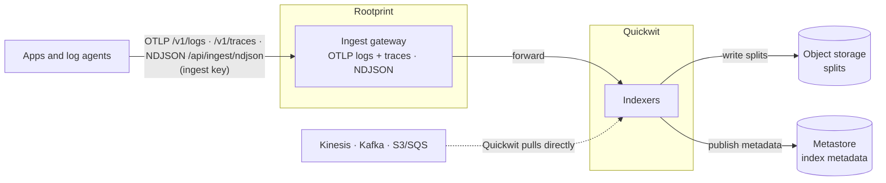
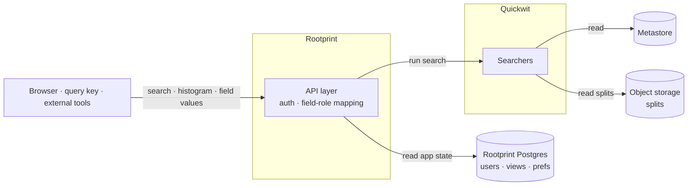

Rootprint is a self-hosted log management platform: ingestion, full-text search, histograms, saved views, access control, and an HTTP API over your logs. It runs search directly on object storage by embedding [Quickwit](https://quickwit.io) as its search and indexing engine.

## The platform and its engine

Rootprint owns the entire log experience: who can sign in, which indexes they see, how each log renders, and the saved views, share links, and audit trail they build on top. For the heavy lifting of indexing and search, it drives an embedded Quickwit engine.

| Layer | Responsibilities |
| ----- | ---------------- |
| **Rootprint**, the platform (single-node) | Web UI, authentication and users, OAuth (Google/GitHub), the ingest gateway, the search and API layer, access rules, **field-role** presentation mapping, log-to-trace correlation, saved views, share links, and the activity/audit trail. |
| **Quickwit**, the search engine (scales horizontally) | Indexing pipelines, full-text search and aggregations, split storage, the metastore, and pull-based sources (Amazon Kinesis, Apache Kafka, files via S3/SQS). |

The engine carries the indexing and search load, so Rootprint stays lightweight and single-node while Quickwit grows to match your volume. See [Scaling beyond a single node](/install/scaling) for how to grow it.

## How data flows

### Ingest

1. **Producers** push logs to Rootprint's ingest gateway: OTLP over HTTP at `/v1/logs` or NDJSON at `/api/ingest/ndjson`. Both require an ingest API key (prefix `rp_`) that is scoped to exactly one index.
2. Rootprint authenticates the key and **hands the data to its Quickwit engine's ingest API**. It does not transform the payload. The target index defines the schema.
3. **Pull-based sources** (Kinesis, Kafka, S3/SQS) are the exception: you configure them through Rootprint, but Quickwit pulls that data **directly from the source, bypassing the gateway**.
4. Quickwit **indexers** write the indexed data as *splits* to index storage and **publish their metadata to the metastore**.
5. **Spans** arriving at `/v1/traces` are the exception to per-key routing: they always go to the span store named by `TRACE_INDEX_ID`, whatever index the key is scoped to. See [Traces](/traces/overview).

See [Send logs](/send-logs/overview) for the full list of ingestion paths.

### Query

1. A request arrives from the **web UI** (session cookie) or an **external tool** (query API key, prefix `rpk_`).
2. Rootprint **authorizes** the request, reads its own application state from Postgres (saved views, preferences), and applies **field-role mappings**.
3. Rootprint **runs the search on its Quickwit engine**, whose **searchers** read the metastore to plan the query, then read the relevant splits from object storage and return results.

## What's stored where

Three independent stores hold all durable state. Once you know which is which, you know what to back up and what to scale.

| Store | What lives here | Single-node default | Scaled |
| ----- | --------------- | ------------------- | ------ |
| **Rootprint Postgres** | Users, API keys, saved views, preferences, field-role config, share links, search audit records. | Bundled `postgres:17` container. | External/managed Postgres. |
| **Quickwit metastore** | Index configuration, split metadata, source checkpoints, index-creation state. | File on local disk. | PostgreSQL (Quickwit's distributed metastore). |
| **Index storage** | The splits: your indexed logs, and the span store's spans. | Local Docker volume. | S3, Azure Blob, or GCS object storage. |

<Warning>
	These three stores are separate from each other. Rootprint's Postgres database and Quickwit's
	metastore must each be their own database, even if they share a Postgres server. Deleting the
	index-storage volume permanently destroys your logs.
</Warning>

## What this means for you

- **Scale Quickwit, keep one Rootprint.** Grow capacity by adding Quickwit indexer and searcher nodes; run a single Rootprint instance in front of them. The [scaling guide](/install/scaling) covers the cluster topology.
- **Back up all three stores.** Rootprint Postgres, the Quickwit metastore, and index storage each hold state the others can't reconstruct.
- **Rootprint is the only authenticated entry point.** Put it on your public URL and keep Quickwit private.

## Related

- [Docker Compose install](/install/docker-compose): the single-node setup and how to move storage to S3.
- [Scaling beyond a single node](/install/scaling): growing the Quickwit cluster.
- [Indexes](/indexes): how Quickwit indexes and schemas organize your logs.
- [Send logs](/send-logs/overview): every ingestion path in detail.
