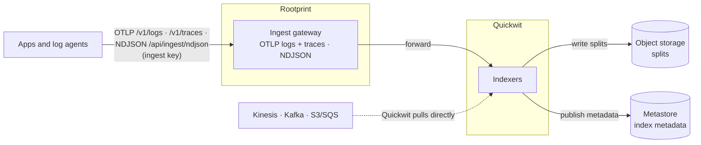
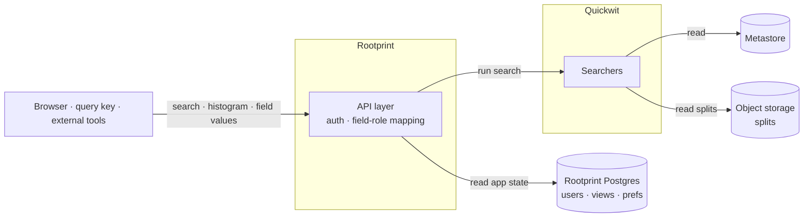

## The platform and its engine

| Layer | Responsibilities |
| ----- | ---------------- |
| **Rootprint**, the platform (single-node) | Web UI, users and sign-in, the ingest gateway, the search API, field-role mappings, log-to-trace correlation, saved views, share links, and the audit trail. |
| **Quickwit**, the search engine (scales horizontally) | Indexing, full-text search and aggregations, index storage, the metastore, and pull-based sources (Amazon Kinesis, Apache Kafka, files via S3/SQS). |

To grow capacity, see [Scaling beyond a single node](/install/scaling). Quickwit has no authentication of its own: serve Rootprint on your public URL and keep Quickwit private.

## How data flows

### Ingest

```mermaid
flowchart LR
    apps[Apps and log agents]
    pull[Kinesis · Kafka · S3/SQS]
    subgraph rp[Rootprint]
        gw["Ingest gateway<br/>OTLP logs + traces · NDJSON"]
    end
    subgraph qw[Quickwit]
        idx[Indexers]
    end
    store[("Object storage<br/>splits")]
    meta[("Metastore<br/>index metadata")]

    apps -->|"OTLP /v1/logs · /v1/traces · NDJSON /api/ingest/ndjson<br/>(ingest key)"| gw
    gw -->|forward| idx
    pull -.->|Quickwit pulls directly| idx
    idx -->|write splits| store
    idx -->|publish metadata| meta
```

- Every push needs an ingest API key (`rp_`), scoped to one index. Logs go to that index. Spans always go to the span store. See [Traces](/traces/overview).
- Rootprint forwards the payload to Quickwit unchanged, so it must match the target index's schema.
- Pull-based sources are configured in Rootprint, but Quickwit reads them directly, bypassing the gateway.

See [Send logs](/send-logs/overview) for the full list of ingestion paths.

### Query

```mermaid
flowchart LR
    user[Browser · query key · external tools]
    subgraph rp[Rootprint]
        api["API layer<br/>auth · field-role mapping"]
    end
    subgraph qw[Quickwit]
        srch[Searchers]
    end
    pg[("Rootprint Postgres<br/>users · views · prefs")]
    store[("Object storage<br/>splits")]
    meta[(Metastore)]

    user -->|"search · histogram · field values"| api
    api -->|read app state| pg
    api -->|run search| srch
    srch -->|read| meta
    srch -->|read splits| store
```

The web UI authenticates with a session cookie. External tools use a [query API key](/api/query-logs) (`rpk_`).

## What's stored where

Three independent stores hold all durable state.

| Store | What lives here | Single-node default | Scaled |
| ----- | --------------- | ------------------- | ------ |
| **Rootprint Postgres** | Users, API keys, saved views, preferences, field-role config, share links, search audit records. | Bundled `postgres:17` container. | External/managed Postgres. |
| **Quickwit metastore** | Index configuration, split metadata, source checkpoints. | File on local disk. | PostgreSQL (Quickwit's distributed metastore). |
| **Index storage** | The splits: your indexed logs, and the span store's spans. | Local Docker volume. | S3, Azure Blob, or GCS object storage. |

<Warning>
	Rootprint's Postgres database and Quickwit's metastore must each be their own database, even
	if they share a Postgres server. Back up all three stores: each holds state the others cannot
	reconstruct. Deleting the index-storage volume permanently destroys your logs.
</Warning>

## Related

- [Docker Compose install](/install/docker-compose): the single-node setup and how to move storage to S3.
- [Scaling beyond a single node](/install/scaling): growing the Quickwit cluster.
- [Indexes](/indexes): how Quickwit indexes and schemas organize your logs.
- [Send logs](/send-logs/overview): every ingestion path in detail.
